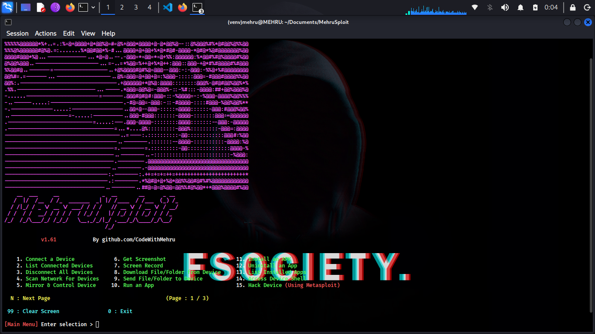

<div align="center">
  
# MehruXploit
  
### MehruXploit with Metasploit Integration.

An all-in-one hacking tool written in `Python` to remotely exploit Android devices using `ADB` (Android Debug Bridge) and `Metasploit-Framework`.

</div>

#### Complete Automation to get a Meterpreter session in One Click

This tool can automatically __Create__, __Install__, and __Run__ payload on the target device using __Metasploit-Framework__ and __ADB__ to completely hack the Android Device in one click if the device has open ADB port `TCP 5555`.

The goal of this project is to make penetration testing and vulnerability assessment on Android devices easy. Now you don't have to learn commands and arguments, MehruXploit does it for you. Using this tool, you can test the security of your Android devices easily.

> [!TIP]  
> __MehruXploit__ can also be used as a complete ADB Toolkit to perform various operations on Android devices over Wi-Fi as well as USB. 

# Screenshots



# Features
## v1.0

* Connect device using ADB remotely.
* List connected devices.
* Disconnect all devices.
* Access connected device shell.
* Stop ADB Server.
* Take screenshot and pull it to computer automatically.
* Screen Record target device screen for a specified time and automatically pull it to computer.
* Download file/folder from target device.
* Send file/folder from computer to target device.
* Run an app.
* Install an APK file from computer to target device.
* Uninstall an app.
* List all installed apps in target device.
* Restart/Reboot the target device to `System`, `Recovery`, `Bootloader`, `Fastboot`.
* __Hack Device Completely__ :
  - Automatically fetch your `IP Address` to set `LHOST`.
  - Automatically create a payload using `msfvenom`, install it, and run it on target device.
  - Then automatically launch and setup __Metasploit-Framework__ to get a `meterpreter` session.
  - Getting a `meterpreter` session means the device is completely hacked using Metasploit-Framework, and you can do anything with it.

## v1.1

* List all files and folders of the target devices.
* Copy all WhatsApp Data to computer.
* Copy all Screenshots to computer.
* Copy all Camera Photos to computer.
* Take screenshots and screen-record anonymously (Automatically delete file from target device).
* Open a link on target device.
* Display an image/photo on target device.
* Play an audio on target device.
* Play a video on target device.
* Get device information.
* Get battery information.
* Use Keycodes to control device remotely.

## v1.2

* Send SMS through target device.
* Unlock device (Automatic screen on, swipe up and password input).
* Lock device.
* Dump all SMS from device to computer.
* Dump all Contacts from device to computer.
* Dump all Call Logs from device to computer.
* Extract APK from an installed app.

## v1.3

* Mirror and Control the target device.

## v1.4

* Power off the target device.

## v1.5

* Scan local network for connected devices to get Target IP Address.

## v1.6

* Record Microphone Audio  
* Stream Microphone Audio  
* Record Device Audio  
* Stream Device Audio  

# Requirements  
* [`python3`](https://www.python.org/) : Python 3.10 or Newer  
* [`pip`](https://pip.pypa.io/en/stable/installation/) : Python Package Installer  
* [`adb`](https://developer.android.com/studio/command-line/adb) : Android Debug Bridge  
* [`metasploit-framework`](https://www.metasploit.com/) : Metasploit (msfvenom + msfconsole)  
* [`scrcpy`](https://github.com/Genymobile/scrcpy)  
* [`nmap`](https://nmap.org/)  

# Run MehruXploit

__MehruXploit__ does not need any installation and runs directly using `python3`.

> [!IMPORTANT]  
> **MehruXploit** requires Python version __3.10 or higher__. Please update Python before running the program.

#### On Linux / macOS :
Make sure all the [required](#requirements) software are installed.

### **1. Clone the repository**
```
git clone https://github.com/CodeWithMehru/MehruXploit.git
cd MehruXploit/
```

### **2. Create a virtual environment**
```
python3 -m venv venv
```

### **3. Activate the virtual environment**
```
source venv/bin/activate
```

### **4. Install dependencies**
```
pip install -r requirements.txt
```

### **5. Run MehruXploit**
```
python3 mehruxploit.py
```

---

## 🔹 Windows

Make sure all the [required](#requirements) software are installed.

### **1. Clone the repository**

```
git clone https://github.com/CodeWithMehru/MehruXploit.git
cd MehruXploit/
```

### **2. Create a virtual environment**
```
python -m venv venv
```

### **3. Activate the virtual environment**
```
venv\Scripts\activate
```

### **4. Install dependencies**
```
pip install -r requirements.txt
```

### **5. Install platform-tools**
1. Download and extract **platform-tools** from Google  
2. Copy everything from `platform-tools` into the **MehruXploit** folder

### **6. Run MehruXploit**
```
python mehruxploit.py
```


# Tutorial

## Setting up Android Phone for the first time

### Enable Developer Options
1. Open `Settings`.  
2. Go to `About Phone`.  
3. Tap `Build Number` 7 times.  
4. Enter your lock screen password.  
5. Developer options will be enabled.

### Enable USB Debugging
1. Go to `System` → `Developer options`.  
2. Enable `USB debugging`.  

### Connect with Computer
1. Connect phone + PC to same Wi-Fi.  
2. Connect USB cable for first-time authorization.  
3. Run:
```
adb devices
```
4. Press *Allow USB Debugging*.  
5. Then:
```
adb tcpip 5555
```
6. Disconnect USB.  
7. Check phone’s IP in `About Phone → Status`.  
8. Run __MehruXploit__ and connect using the IP.

## Next Time Connection
Just open __MehruXploit__ → Connect → Enter IP.

# This tool is tested on

- Ubuntu  
- Linux Mint  
- Kali Linux  
- Fedora  
- Arch Linux  
- Parrot OS  
- Windows 11  
- Termux (Android)

> [!NOTE]  
> Linux is recommended for best performance.

# Installing ADB
### Linux
(Debian/Ubuntu)
```
sudo apt update
sudo apt install adb
```
(Fedora)
```
sudo dnf install adb
```
(Arch/Manjaro)
```
sudo pacman -Sy android-tools
```

### macOS
```
brew install android-platform-tools
```

### Windows  
Download platform-tools from Google.

### Termux  
```
pkg update
pkg install android-tools
```

# Installing Metasploit
### Linux/macOS
```
curl https://raw.githubusercontent.com/rapid7/metasploit-omnibus/master/config/templates/metasploit-framework-wrappers/msfupdate.erb > msfinstall && \
chmod 755 msfinstall && \
./msfinstall
```

### Windows  
Download installer from Metasploit.

# Installing scrcpy
Follow the official guide:  
https://github.com/Genymobile/scrcpy#get-the-app

# Installing Nmap
### Linux
(Debian/Ubuntu)
```
sudo apt install nmap
```
(Fedora)
```
sudo dnf install nmap
```
(Arch/Manjaro)
```
sudo pacman -Sy nmap
```

### macOS  
```
brew install nmap
```

### Windows  
Download from nmap.org.

### Termux  
```
pkg install nmap
```

# Disclaimer

* This project is for **educational purposes only**.  
* Developer is **not responsible** for misuse or damage.  
* Do not use without permission.  
* Use responsibly and legally.  
* Intended for penetration testing on your **own devices only**.

---

**Copyright © 2025 Code With Mehru**
